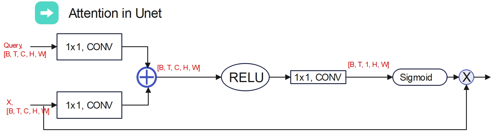
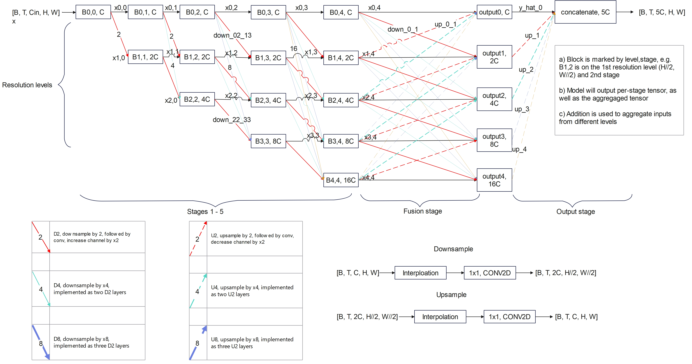
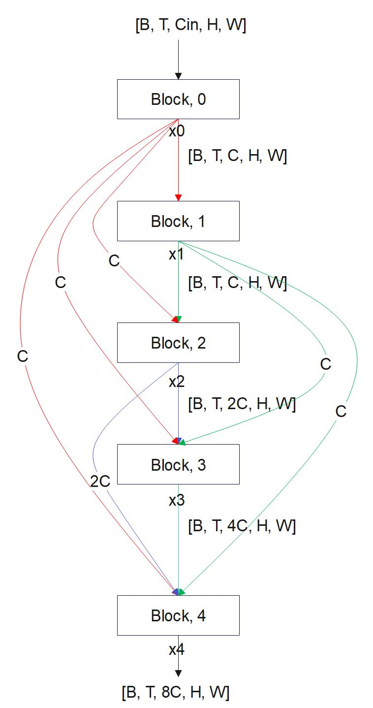

# Imaging Foundation Model for Clinical and Biomedical Imaging (FM-Imaging)

## Background

The established imaging modalities (e.g. MRI, CT, US or Microscopy etc.) serve as a foundation to develop deep learning applications for imaging AI. The diversity in modalities, anatomies, imaging experiment setups, and downstream tasks (e.g., analyzing, quantifying images) poses challenges. Conventional deep learning workflows require application-specific data collection, model training, and model deployment. Such application-specific AI workflows are difficult to scale up for new imaging tasks, as collecting data and generating labels are costly. This case-by-case development model requires generating and collecting labelled datasets for every task separately. Further, data samples acquired for one task may not help another task, by only training the task specific model from the scratch. This is one major barrier to develop broader clinical imaging AI, as there are many different tasks, but datasets for every task is either to-be-generated or small. 

With the recent success in large language model for multi-task generalization, it is a question to ask whether imaging AI can enjoy the similar success. This project aims to develop foundation model for clinical and biomedical imaging and evaluate its generalization performance on new tasks with limited labeled data.

Aims:

- Develop and train backbone models on multi-modality imaging data
- Develop methods to quickly adapt the backbone model to new imaging tasks, with reduced data labeling effort
- Develop and deploy front-end and backbone models to enable user-driven imaging AI development

## Data formation

Unlike the ImageNet type images, the clinical or biomedical imaging brings in more variation in image formation. The imaging can acquire 2D, 2D+T dynamic or 3D images. Sometimes, 3D+T dynamic volume imaging can be performed as well. At the minimum, we will handle 2D, 2D+T and 3D images. We propose an uniform model to process three image formation as the tensor [B, T/SLC, C, H, W]. The 1st dimension can be temporal for 2D+T or SLC or Z direction for 3D volume. For the 2D images, the T/SLC will be 1. C is the channel of images; H and W are height and weight.

```
Tensor format: [B, T/SLC, C, H, W]
```

## Hypothesis

The transformer type models can learn and generalize broad knowledge across multiple downstream tasks. In the LLMs, it can lead to emergent abilities with few-shot in-context learning. Here we hypothesize modified transformer models can learn general knowledge of anatomy, imaging and pathology for major imaging modalities and be used as general-purpose backbone.


## Modules for the foundation model

### Local, global and temporal attention

Instead of cutting images into patches and process them with the standard transformer, we propose to explore both spatial and temporal/slice correlation with three attention mechanisms. 


**Local spatial attention (L)** 
As shown by the red dots, local attention is computed by using the neighboring pixels in images or feature maps. The feature vectors at all red locations (key and values, K and V) are compared to the yellow vector (Q, query) to compute the attention coefficients. The attention outputs for yellow pixel is a weighted sum of value vectors.This is the same operation as the [swin transformer](https://arxiv.org/abs/2103.14030).

**Global spatial attention (G)**
While the local attention only explores neighboring pixels, global attention looks at more remote pixels for correlation. This will help model learn global information over large field-of-view. In the global attention, the blue vectors serve as K and V. The yellow vector, as Q, will compute its attention to K vectors. 

ref [here](https://ai.googleblog.com/2022/09/a-multi-axis-approach-for-vision.html).

**Conv vs. Linear**
To implement local and global attention, linear Q/K/V parameter matrixes can be utilized in the attention mechanism:

$$Q = W_q F, K = W_k F, V = W_v F$$

where the parameter matrixes are $W_q, W_k, W_v$. $F$ is the flattened feature vectors.

The computation increases quadratically as the number of pixels in the attention window. However, the patch size cannot be too small (otherwise, all pixels in a window can be too similar and attention will not be effective).

Alternatively, we can parameterize the Q/K/V computation with convolution:

$$Q = {CONV}_q (F), K = {CONV}_k (F), V = {CONV}_v (F)$$

Here $CONV$ is the convolution over [C, H, W] for the pixels in the window and $F$ is the un-flattened feature maps.

Compare to the linear matrixes, the $CONV$ keeps the inductive bias and significantly reduce the computational cost. For the global attention, this is equivalent to dilated convolution.

**Temporal attention (T)**
The temporal or slice correlation is explored by computing the temporal attention. Given $T$ images or feature maps in a tensor $[B, T, C, H, W]$, the attention is computed between each $[C, H, W]$ array, resulting to a $T \times T$ attention matrix. Given the very high number of pixels in feature maps, the $CONV$ is used to compute $Q/K/V$.

These **L, G, T** attention mechanisms are implemented as **Attention** modules.

### Cell

After implementing each attention module, a **Cell** is defined as one **Attention** module with the **mixer**. Given an input tensor $[B, T, C_{in}, H, W]$, a Cell transforms the input tensor and produce another tensor $[B, T, C_{out}, H, W]$.


Two cell architectures are implemented: **sequential** and **parallel**.

ref for parallel: [here](https://arxiv.org/abs/2302.05442). 

Different $Norm$ operations are supported: 

| Norm | Description |
| ----------- | ----------- |
| LayerNorm | normalize over [C, H, W] |
| BatchNorm 2D | normalize over [H, W], B*T are batch dimension |
| BatchNorm 3D | normalize over [T, H, W] |
| InstanceNorm 2D | normalize over [H, W]|
| InstanceNorm 3D | normalize over [T, H, W]|

Except the layernorm, all other norms support variable sized images, when using with the $CONV$ in attention layers.

The $Mixer$ is implemented as convolution 2D operations, along the $[C, H, W]$:

```
self.mlp = nn.Sequential(
                Conv2DExt(C_out, 4*C_out, kernel_size=kernel_size, stride=stride, padding=padding, bias=True),
                nn.GELU(),
                Conv2DExt(4*C_out, C_out, kernel_size=kernel_size, stride=stride, padding=padding, bias=True),
                nn.Dropout(dropout_p),
            )
```

User can specify whether a cell has mixer or not.

Overall, we name the spatial-temporal CNN transformers as **ST-CNNT**.

### Block
A block is a stack of cells. For example, a block with local, global and temporal attentions can be built as:


This block is coded as the block string "L1G1T1". The letter "L", "G" or "T" means an attention layer. "1" means the mixer is added on top of the attention mechanism. As an example, "L0L1G0G1T1" means a block with 5 attention layers. Mixers are not added to the first and third attentions, but added after the second and fourth attentions. The last cell is a temporal attention with its mixer added.

This block string method gives a good amount of flexibility to assemble and test different attention configurations. Depending on the image resolutions and number of feature maps, different blocks in a model can have different attention configuration.

## Backbone models
How to put together attention modules to make a model? How many attentions will we need? In what architecture? 

In the LLMs, the stack of attentions proves to be very effective. For imaging, previous researches had explored similar architecture (e.g. [3B swin v2](https://arxiv.org/abs/2111.09883) and [20B ViT](https://arxiv.org/abs/2302.05442)). With our intention to combine convolution back into the transformer and to utilize the inductive bias, we should explore different architectures.

### ST-CNNT U-Net

The U-net architecture is enhanced with ST-CNNT cells. 


Here every resolution stage includes one block containing multiple cells. Model can specify number of feature maps at each resolution stage. The [Unet with attention](https://arxiv.org/abs/1804.03999) is implemented here. Downsample and upsample are implemented with interpolation.

The attention in unet is added to gate the feature map in lower resolution level to guide the higher resolution.



### ST-CNNT HR-Net

This network is modified from the [high-resolution architecture](https://www.microsoft.com/en-us/research/blog/high-resolution-network-a-universal-neural-architecture-for-visual-recognition/).




The network is defined as levels and stages. Every block is numbered by its level and stage indexes (starting from 0). The downsample and upsample modules are added to link different blocks. Different up/downsample modules are implemented, with TLG attentions or 1x1 CONV. Bilinear interpolation is used to alter spatial resolution.

After the fusion stage, the model will output per-level tensors and the aggregated tensor. 

### ST-CNNT LLM

As a baseline, the stack of blocks serves as an architecture similar to the LLMs. The difference is the non-causal attention is used in all blocks and we added the dense skip connections between blocks.



In the current design, the Block will not change number of input channels. 

