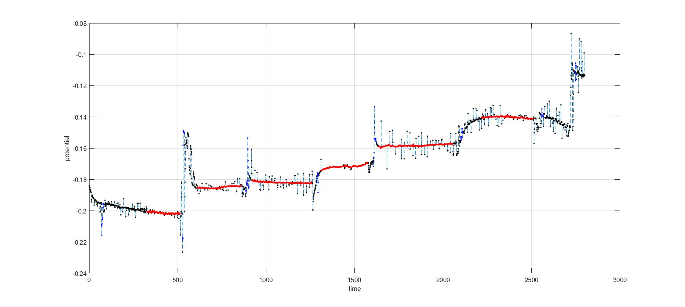
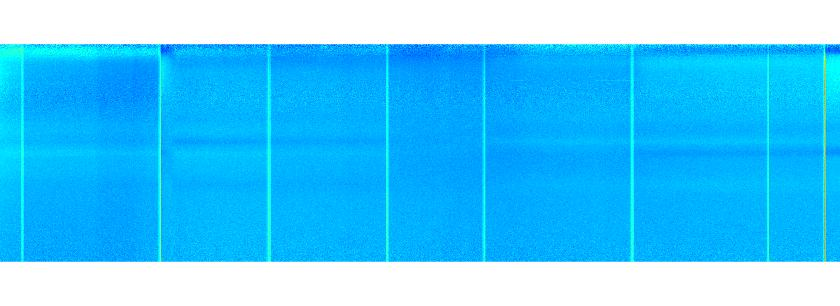

# Membrane potential prediction with transformers

This is a supplement project based on the FM-Imaging. 

## Background

The membrane potential is measure by changing the stimulating wave length of lasers. Current electronics is not reliable to measure the potential during the transition period. The steady state measurement is more reliable. The red points are selected measurements with confidence. The black points are excluded measurements. The blue points are the chemical injection moments, where the input waveform measurements are not reliable.



The waveform measurement is organized as $D \times T$. $D$ is the measured waveform at a given time point. 



## Goal

The input is the waveform data at every time point. The output is the predicted potential. Input tensor is $[B, T, D]$ and output tensor is $[B, T, 1]$.

## Data

Input data has following fields:

```
               A: [725×2801 double] # waveform, feature by time
              MP: [2801×1 double]   # membrane potential
    i_valid_spec: [2801×1 logical]  # valid time points if 1; invalid time points if 0, due to chemical injection
      idx_select: [2801×1 logical]  # selected time points if 1, indicating the valid MP measurements
             wav: [725×1 double]    # wave length in A
```

## Architecture

[B, T, Din] -> linear layer -> [B, T, D] -> + -> transformer x N -> [B, T, D] --> linear layer -> relu --> linear layer -> [B, T, 1]

After the first linear layer, the positional encoding is added.

## Loss and optimization

The L2 + L1 loss is computed, only on the valid  time points. The total variation loss is added to encourage a smoothing curve.

