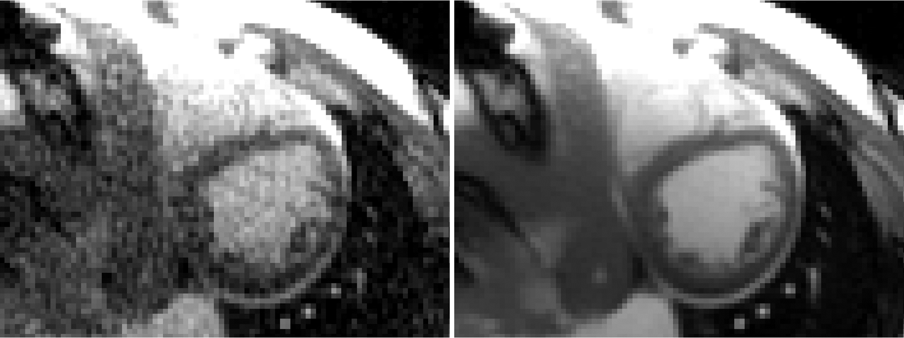

# Projects
The framework is designed to support flexible project configuration, as demonstrated in this projects folder. The framework supports single-task, multi-task and multi-task meta-learning. 

## Start here with simple demos

### Cifar
This is a toy project to demonstrate how to configure a training session. To get start, 

```
bash ./projects/cifar_classify/command_cifar.sh
```

In this example [custom_cifar_run.py](./cifar_classify/custom_cifar_run.py), a simple model is configured, with a ViT backbone, to perform the single-task classfication of cifar 10 dataset.

Another example [custom_cifar10_100_run.py](./cifar_classify/custom_cifar10_100_run.py) demonstrates a more advanced exmaple to jointly train cifar10 and cifar100 tasks, as a two-task classficiation. The backbone is the Swin transformer.

## Full-scale projects

## Long-context leanring

### MRI denoising with SNR unit reconstruction

A real research project we developed to train very powerful imaging model on MRI datasets to recovery underneath signal from corrupted or incomplete acquisition. 



The left shows a 5x accelerated real-time cine imaging without AI model. The right shows the results of model trained with this framework.

To learn more about this project, ref to [Imaging transformer for MRI denoising with the SNR unit training: enabling generalization across field-strengths, imaging contrasts, and anatomy](https://arxiv.org/abs/2404.02382).

@misc{xue2024imagingtransformermridenoising,
      title={Imaging transformer for MRI denoising with the SNR unit training: enabling generalization across field-strengths, imaging contrasts, and anatomy}, 
      author={Hui Xue and Sarah Hooper and Azaan Rehman and Iain Pierce and Thomas Treibel and Rhodri Davies and W Patricia Bandettini and Rajiv Ramasawmy and Ahsan Javed and Zheren Zhu and Yang Yang and James Moon and Adrienne Campbell and Peter Kellman},
      year={2024},
      eprint={2404.02382},
      archivePrefix={arXiv},
      primaryClass={eess.IV},
      url={https://arxiv.org/abs/2404.02382}, 
}

The detailed instructions to set up the training is [here](./mri/README.md).